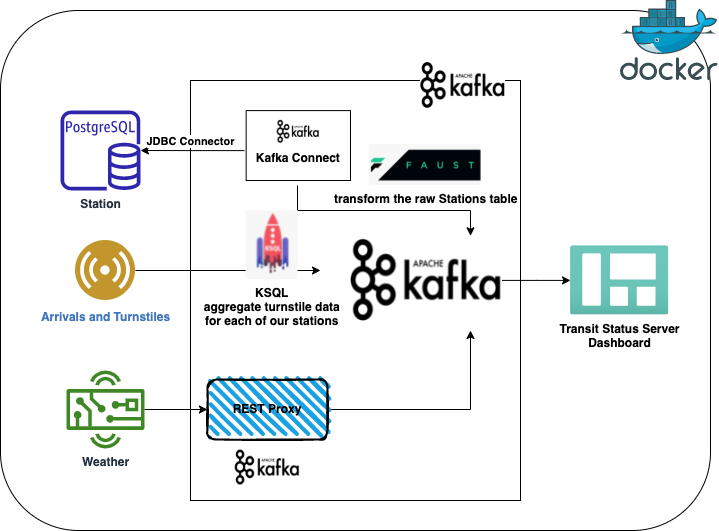

    

<h1 align="center">Data Streaming Nanodegree</h1>

<h3 align="center">Udacity Nanodegree</h3>

> Technologies used: 
Apache Kafka, Kafka Connect, KSQL, Faust Stream Processing, Spark Structured Streaming

## About The Nanodegree

Data Streaming skill was gained to be prepared for the next era of data engineering. Learned how to analyze data in real-time using Apache Kafka and Spark, and build applications to process live insights from data at scale.

## Program Details

During the program, we completed two courses with two projects. Each course had different aim and technologies used.

#### Course 1. Foundations of Data Streaming 

The goal of this course is to learn the fundamentals of stream processing, including how to work with the Apache Kafka ecosystem, data schemas, ApacheAvro, Kafka connect and REST proxy, KSQL, and Faust Streaming Process. 

Associated exercise files and code can be found [here](https://github.com/youheekil/udacity-data-streaming/tree/main/1_Kafka).

#### Project 1. [Optimize Chicago Public Transit](https://github.com/youheekil/udacity-data-streaming/tree/main/Project%20-%20Optimizing%20Public%20Transportation)

#### Course 2. Streaming API Development and Documentation

In this course, the goal is to grow the expertise in the components of streaming data systems, and build a real time analytics application. After this course, you will be able to identify Spark streaming (architecture and API) components, consume and process data from Apache Kafka with Spark Structured Streaming (including setting up and running a Spark Cluster), create a DataFrame as an aggregation of Source DataFrames, sink a composite DataFrame to Kafka, and visually inspect a data sink of accuracy. 

The relevant codes for the listed description can be found [here](https://github.com/youheekil/udacity-data-streaming/tree/main/2_Spark_exercise)

#### Project 2. [Evaluate Human Balace with Spark Streaming](https://github.com/youheekil/udacity-data-streaming/tree/main/Project%20-%20Evaluate%20Human%20Balance%20with%20Spark%20Streaming)
